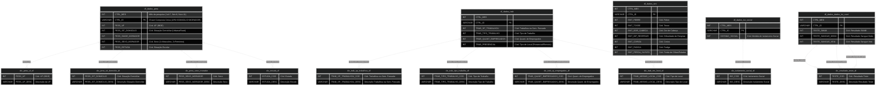

# Modelo Entidade-Relacionamento (MER)
***

```mermaid
%%{init: {'theme': 'dark'}}%%
erDiagram
    %% Tabelas Fato/Dados (Extraídas do df_renamed)

    df_dados_pess {
        INT CTRL_MES "Mês da pesquisa (Jul=7, Set=9, Nov=11)"
        VARCHAR CTRL_ID PK "Chave Composta Única (UPA+DOMICILIO+MORADOR)"
        INT PESS_UF "Cód. UF (IBGE)"
        INT PESS_SIT_DOMICILIO "Cód. Situação Domiciliar (Urbana/Rural)"
        INT PESS_IDADE_MORADOR
        INT PESS_SEXO_MORADOR "Cód. Sexo (1=Masculino, 2=Feminino)"
        INT PESS_ESTUDA "Cód. Situação Escolar"
    }

    df_dados_trab {
        INT CTRL_MES
        VARCHAR CTRL_ID PK
        INT TRAB_SP_TRABALHOU "Cód. Trabalhou na Sem. Passada"
        INT TRAB_TIPO_TRABALHO "Cód. Tipo de Trabalho"
        INT TRAB_QUANT_EMPREGADOS "Cód. Quant. de Empregados"
        INT TRAB_PRESENCIAL "Cód. Tipo de Local (Presencial/Remoto)"
    }

    df_dados_sint {
        INT CTRL_MES
        VARCHAR CTRL_ID PK
        INT SINT_FEBRE "Cód. Febre"
        INT SINT_TOSSE "Cód. Tosse"
        INT SINT_DOR_CABECA "Cód. Dor de Cabeça"
        INT SINT_DIF_RESPIRAR "Cód. Dificuldade de Respirar"
        INT SINT_CORIZA "Cód. Coriza"
        INT SINT_FADIGA "Cód. Fadiga"
        INT SINT_PERDA_OLFATO "Cód. Perda de Olfato/Paladar"
    }
    
    df_dados_iso_social {
        INT CTRL_MES
        VARCHAR CTRL_ID PK
        INT DISTANC_SOCIAL "Cód. Medida de Isolamento Social"
    }

    df_dados_dados_tst_covd {
        INT CTRL_MES
        VARCHAR CTRL_ID PK
        INT TESTE_SWAB "Cód. Resultado SWAB"
        INT TESTE_SANGUE_DEDO "Cód. Resultado Sangue Dedo"
        INT TESTE_SANGUE_VEIA "Cód. Resultado Sangue Veia"
    }

    %% Tabelas Dicionário (Dimensões)

    dic_pess_uf_df {
        INT PESS_UF "Cód. UF (IBGE)"
        VARCHAR PESS_UF_DESC "Descrição da UF"
    }

    dic_pess_sit_domicilio_df {
        INT PESS_SIT_DOMICILIO "Cód. Situação Domiciliar"
        VARCHAR PESS_SIT_DOMICILIO_DESC "Descrição Situação Domiciliar"
    }

    dic_pess_sexo_morador {
        INT PESS_SEXO_MORADOR "Cód. Sexo"
        VARCHAR PESS_SEXO_MORADOR_DESC "Descrição Sexo"
    }

    dic_estuda_df {
        INT ESTUDA_COD "Cód. Estuda"
        VARCHAR ESTUDA_DESC "Descrição Estuda"
    }

    dic_trab_sp_trabalhou_df {
        INT TRAB_SP_TRABALHOU_COD "Cód. Trabalhou na Sem. Passada"
        VARCHAR TRAB_SP_TRABALHOU_DESC "Descrição Trabalhou na Sem. Passada"
    }

    dic_trab_tipo_trabalho_df {
        INT TRAB_TIPO_TRABALHO_COD "Cód. Tipo de Trabalho"
        VARCHAR TRAB_TIPO_TRABALHO_DESC "Descrição Tipo de Trabalho"
    }

    dic_trab_qt_empregados_df {
        INT TRAB_QUANT_EMPREGADOS_COD "Cód. Quant. de Empregados"
        VARCHAR TRAB_QUANT_EMPREGADOS_DESC "Descrição Quant. de Empregados"
    }

    dic_trab_ms_local_df {
        INT TRAB_MESMO_LOCAL_COD "Cód. Tipo de Local"
        VARCHAR TRAB_MESMO_LOCAL_DESC "Descrição Tipo de Local"
    }

    dic_isolamento_social_df {
        INT ISO_COD "Cód. Isolamento Social"
        VARCHAR ISO_DESC "Descrição Isolamento Social"
    }

    dic_resultado_teste_df {
        INT TESTE_COD "Cód. Resultado Teste"
        VARCHAR TESTE_DESC "Descrição Resultado Teste"
    }

    %% Relacionamentos (Conexão)
    %% Relação (FK) -- Relação (PK) : Tipo de Relação (||--||, ||--|o, o|--||, o|--|o) : Nome da Relação

    df_dados_pess ||--o{ dic_pess_uf_df : PESS_UF
    df_dados_pess ||--o{ dic_pess_sit_domicilio_df : PESS_SIT_DOMICILIO
    df_dados_pess ||--o{ dic_pess_sexo_morador : PESS_SEXO_MORADOR
    df_dados_pess ||--o{ dic_estuda_df : PESS_ESTUDA

    df_dados_trab ||--o{ dic_trab_sp_trabalhou_df : TRAB_SP_TRABALHOU
    df_dados_trab ||--o{ dic_trab_tipo_trabalho_df : TRAB_TIPO_TRABALHO
    df_dados_trab ||--o{ dic_trab_qt_empregados_df : TRAB_QUANT_EMPREGADOS
    df_dados_trab ||--o{ dic_trab_ms_local_df : TRAB_PRESENCIAL

    df_dados_iso_social ||--o{ dic_isolamento_social_df : DISTANC_SOCIAL

    df_dados_dados_tst_covd ||--o{ dic_resultado_teste_df : TESTE_SWAB
    df_dados_dados_tst_covd ||--o{ dic_resultado_teste_df : TESTE_SANGUE_DEDO
    df_dados_dados_tst_covd ||--o{ dic_resultado_teste_df : TESTE_SANGUE_VEIA
```